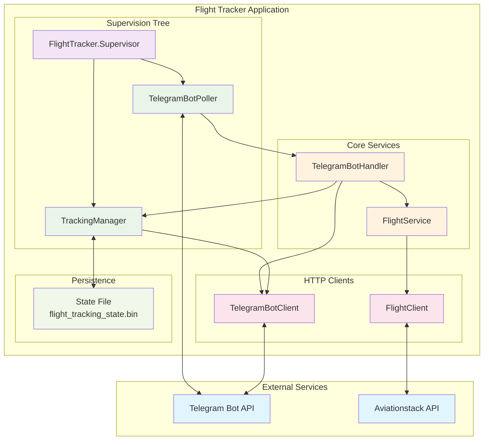
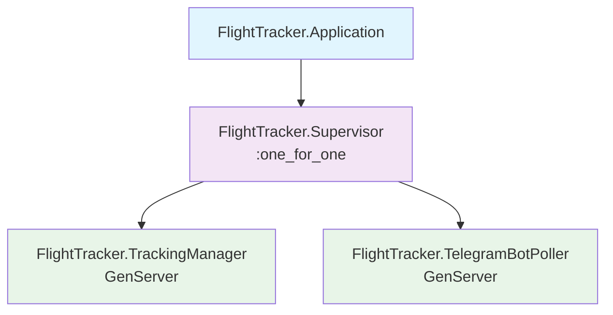
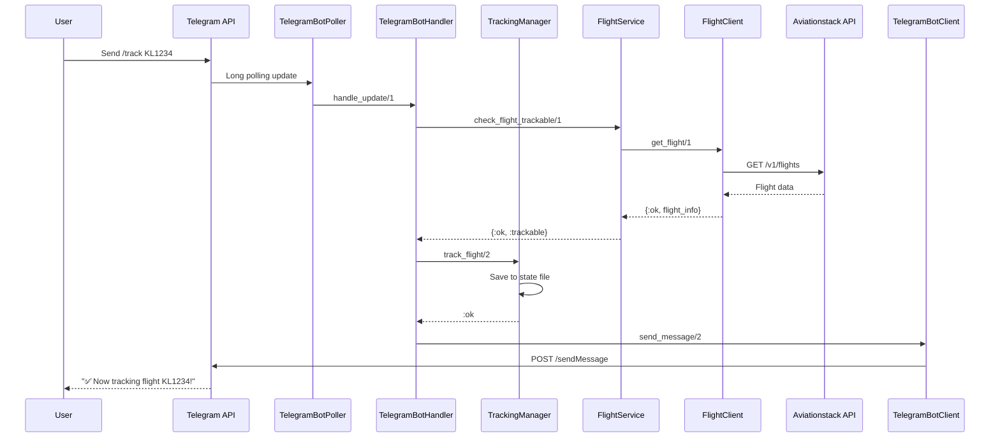
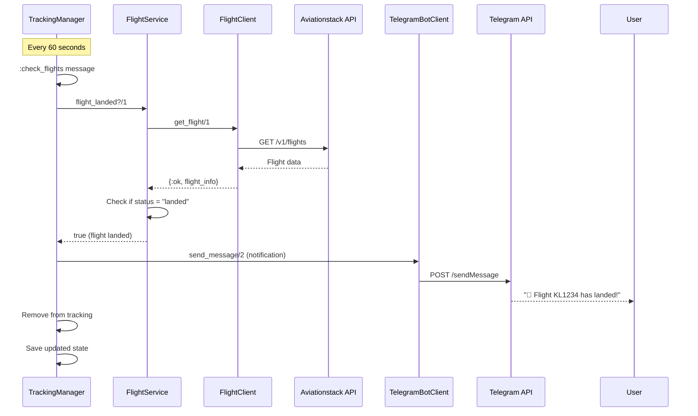

# Flight Tracker System Architecture

This document describes the architecture of the Flight Tracker Telegram Bot, built with Elixir OTP.

## System Overview



## Component Architecture

### Supervision Tree



### Data Flow - User Command Processing



### Data Flow - Periodic Flight Monitoring



## Core Components

### 1. FlightTracker.Application
- **Type**: OTP Application
- **Purpose**: Application entry point and supervision tree setup
- **Responsibilities**:
  - Start supervision tree
  - Configure application-wide settings

### 2. FlightTracker.Supervisor
- **Type**: Supervisor (`:one_for_one` strategy)
- **Purpose**: Supervise core GenServers
- **Children**:
  - `TrackingManager`
  - `TelegramBotPoller`

### 3. FlightTracker.TrackingManager
- **Type**: GenServer
- **Purpose**: Manage flight tracking state and persistence
- **State**: `%{chat_id => MapSet.t(flight_number)}`
- **Responsibilities**:
  - Track/untrack flights per chat
  - Periodic flight status checking (every 60 seconds)
  - State persistence to binary file
  - Send landing notifications
  - Automatic cleanup of landed flights

### 4. FlightTracker.TelegramBotPoller
- **Type**: GenServer
- **Purpose**: Poll Telegram for updates
- **Responsibilities**:
  - Long polling with 30-second timeout
  - Exponential backoff on errors (1s → 60s max)
  - Process updates through `TelegramBotHandler`
  - Webhook cleanup on startup

### 5. FlightTracker.TelegramBotHandler
- **Type**: Module (stateless)
- **Purpose**: Process Telegram messages and commands
- **Supported Commands**:
  - `/start` - Welcome message
  - `/help` - Help information
  - `/track <flight>` - Start tracking
  - `/untrack <flight>` - Stop tracking
  - `/list` - Show tracked flights
  - Direct flight lookup (e.g., "KL1234")

### 6. FlightTracker.FlightService
- **Type**: Module (stateless)
- **Purpose**: High-level flight operations
- **Functions**:
  - `get_flight_info/1` - Get flight details
  - `check_flight_trackable/1` - Pre-flight validation
  - `flight_landed?/1` - Check landing status
  - `format_flight_info/1` - Format for display

### 7. FlightTracker.FlightClient
- **Type**: Module (stateless)
- **Purpose**: HTTP client for Aviationstack API
- **Responsibilities**:
  - API request handling with error management
  - Response parsing and data extraction
  - Rate limiting compliance

### 8. FlightTracker.TelegramBotClient
- **Type**: Module (stateless)
- **Purpose**: HTTP client for Telegram Bot API
- **Functions**:
  - `send_message/2` - Send messages to users
  - `get_updates/2` - Poll for updates
  - `get_me/0` - Get bot information
  - `delete_webhook/0` - Remove webhook

## State Management

### Persistence Strategy
- **Format**: Erlang binary term format (`:erlang.term_to_binary/1`)
- **File**: `flight_tracking_state.bin`
- **Benefits**:
  - Native Elixir data structure preservation
  - DateTime precision maintained
  - Compact file size (~500-1000 bytes typical)
  - Fast encoding/decoding

### State Structure
```elixir
%{
  chat_id_1 => #MapSet<["KL1234", "BA456"]>,
  chat_id_2 => #MapSet<["AF789"]>
}
```

### Persistence Events
- **Load**: On TrackingManager startup
- **Save**: After flight add/remove operations
- **Save**: After flight status updates
- **Save**: On graceful shutdown

## Error Handling

### Telegram API Errors
- **Connection failures**: Exponential backoff retry
- **Rate limiting**: Automatic retry with delays
- **Invalid tokens**: Logged and reported

### Aviationstack API Errors
- **Network issues**: Graceful degradation
- **Rate limits**: Respect API constraints
- **Invalid responses**: User-friendly error messages

### State Persistence Errors
- **File corruption**: Fallback to empty state
- **Write failures**: Logged but non-blocking
- **Missing files**: Initialize with empty state

## Configuration

### Environment Variables
- `TELEGRAM_BOT_TOKEN` - Telegram bot authentication
- `AVIATIONSTACK_API_KEY` - Flight data API access

### Application Configuration
```elixir
config :flight_tracker,
  telegram_token: {:system, "TELEGRAM_BOT_TOKEN"},
  aviationstack_api_key: {:system, "AVIATIONSTACK_API_KEY"}
```

### Logger Configuration
- **Development**: `:debug` level with detailed output
- **Production**: `:info` level with structured logging

## Deployment Architecture

### Production Environment
- **Runtime**: Mix releases with systemd service
- **Configuration**: Environment file (`/etc/flight-tracker/flight-tracker.env`)
- **User**: Dedicated `flightbot` user for security
- **Monitoring**: Systemd service management and logging

### Security Features
- **Non-root execution**: Dedicated service user
- **Environment isolation**: Secure environment variable handling
- **File permissions**: Restricted access to configuration and state files

## Performance Characteristics

### Scalability
- **Memory usage**: ~10-50MB typical
- **CPU usage**: Low, event-driven architecture
- **Network**: Efficient long polling and API usage
- **Storage**: Minimal state file size

### Reliability
- **Fault tolerance**: Supervisor restart strategies
- **State recovery**: Automatic state restoration
- **Error isolation**: Component-level error handling
- **Graceful degradation**: Continues operation during API issues

## Monitoring and Observability

### Logging
- **Structured logging**: JSON format in production
- **Log levels**: Debug, info, warning, error
- **Context**: Request IDs and operation tracking

### Health Checks
- **Telegram connectivity**: Bot info verification
- **API availability**: Periodic health checks
- **State persistence**: File system monitoring

### Metrics
- **Message processing**: Count and latency
- **Flight tracking**: Active flights and users
- **API calls**: Success/failure rates
- **System resources**: Memory and CPU usage 